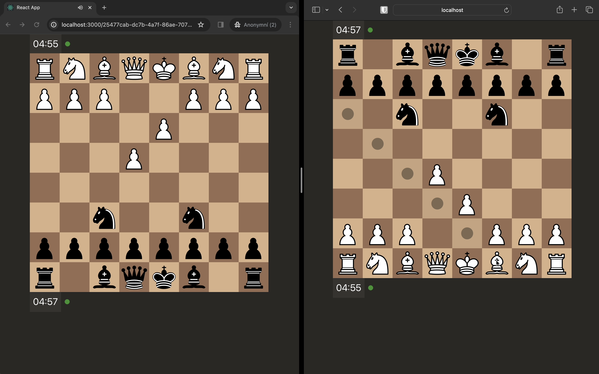

# Online chess - frontend

([Link to video](https://github.com/Krystofee/online-chess/blob/master/img/gameplay.mov))



This was my sideproject just for fun to rediscover the beauty of programming simple things for fun.

The backend is in python and it uses websockets.

# Dependencies

- node v12.22.12 (as specified in .nvmrc)
- npm 8.1.0 (packed with node)

# How to run?

```
npm i
npm run development
```

- run backend server
- visit http://localhost:3000
